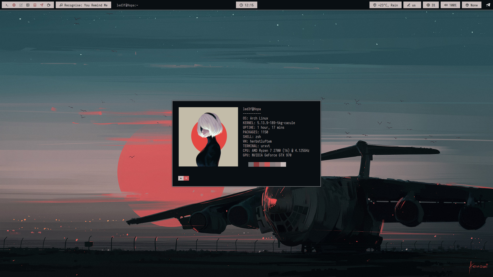

# dots

For Desktop Background image i'm using Nitrogen - https://github.com/l3ib/nitrogen

Compositor is Picom - https://github.com/jonaburg/picom

Spotify Cli for keyboard shorcuts - https://gist.github.com/streetturtle/fa6258f3ff7b17747ee3

# herbstluftwm

# herbstluftwm info

Menu is Rofi - https://github.com/DaveDavenport/rofi

Greenclip - https://github.com/erebe/greenclip

Polybar - https://github.com/jaagr/polybar

Dunst - https://github.com/dunst-project/dunst

Polybar Font - Iosevka Nerd Font

Colorschemes - https://github.com/deviantfero/wpgtk
