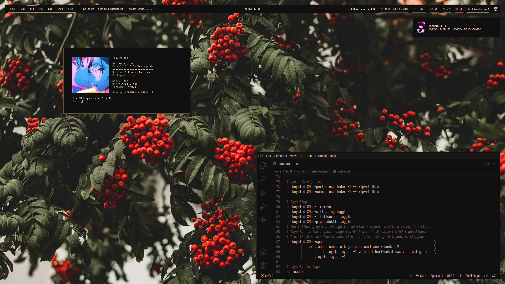
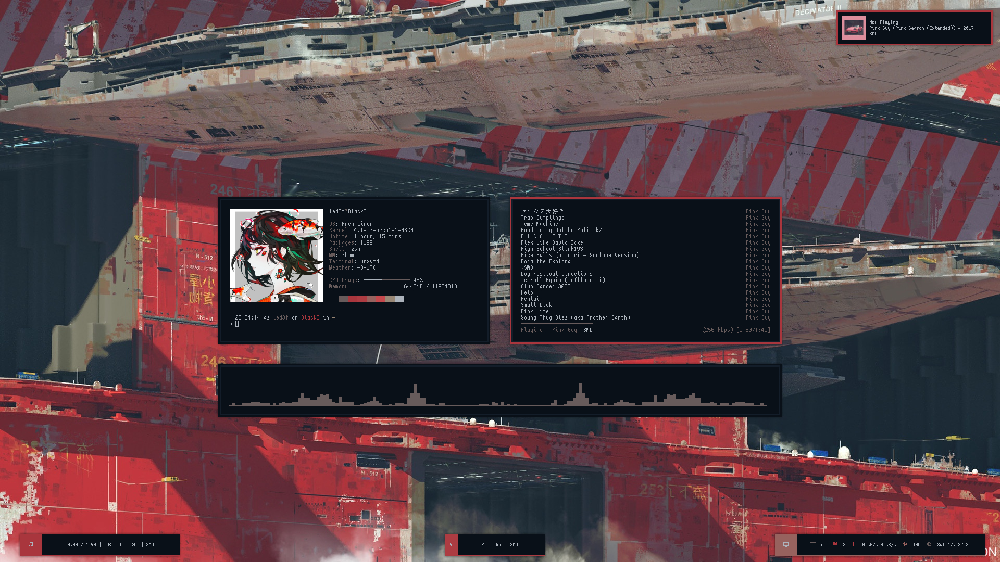
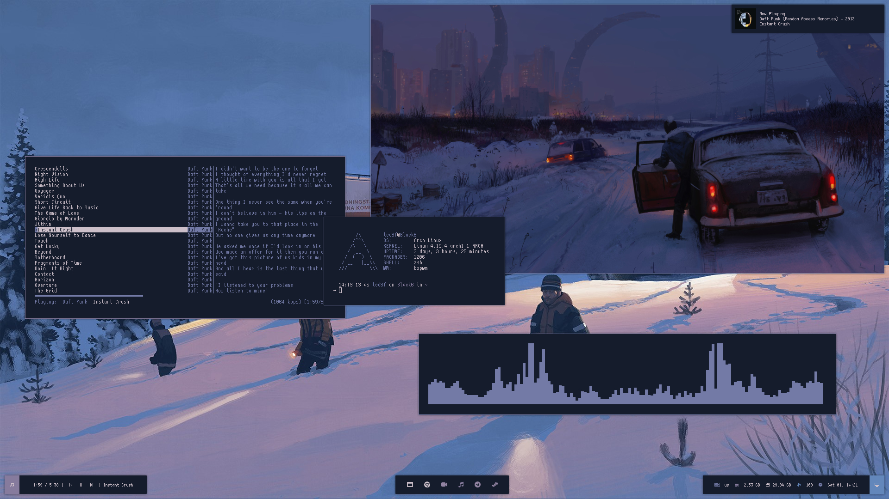

# dots

For Desktop Background image i'm using Nitrogen - https://github.com/l3ib/nitrogen

Compositor is Picom - https://github.com/jonaburg/picom

Spotify Cli for keyboard shorcuts - https://gist.github.com/streetturtle/fa6258f3ff7b17747ee3

Files with pywal at the end are for usage with Pywal

# herbstluftwm

# herbstluftwm info

Menu is Rofi - https://github.com/DaveDavenport/rofi

Greenclip - https://github.com/erebe/greenclip

Polybar - https://github.com/jaagr/polybar

Dunst - https://github.com/dunst-project/dunst

Polybar Font - scientifica + Wuncon Siji

Colorschemes - https://github.com/deviantfero/wpgtk

# 2bwm

# 2bwm info

2bws script - https://github.com/drumsetmonkey/.dotfiles/blob/master/scripts/.scripts/2bws

# bspwm

# bspwm info

Menu is Rofi - https://github.com/DaveDavenport/rofi

Rofi Power Menu - https://github.com/okraits/rofi-tools

Bar is Polybar - https://github.com/jaagr/polybar

Notification Daemon is Dunst - https://github.com/dunst-project/dunst

Polybar Icon Font - Wuncon Siji

# Vivaldi

Start Page - https://catgrills.github.io/Galaxy/

Vivaldi Themes:

| Holo Red Theme:                   | Nim Theme:                        |
| --------------------------------- | --------------------------------- |
| Background: #222222               | Background: #121212               |
| Foreground: #ffffff               | Foreground: #ffffff               |
| Highlight: #f0544c                | Highlight: #ad3d37                |
| Accent: #303030                   | Accent: #202020                   |
| [ ] Accent color from Active Page | [x] Accent color from Active Page |
| [ ] Apply Accent Color to Window  | [ ] Apply Accent Color to Window  |
| [x] Transparent Tabs              | [x] Transparent Tabs              |
| Corner Rounding: 2px              | Corner Rounding: 1px              |
