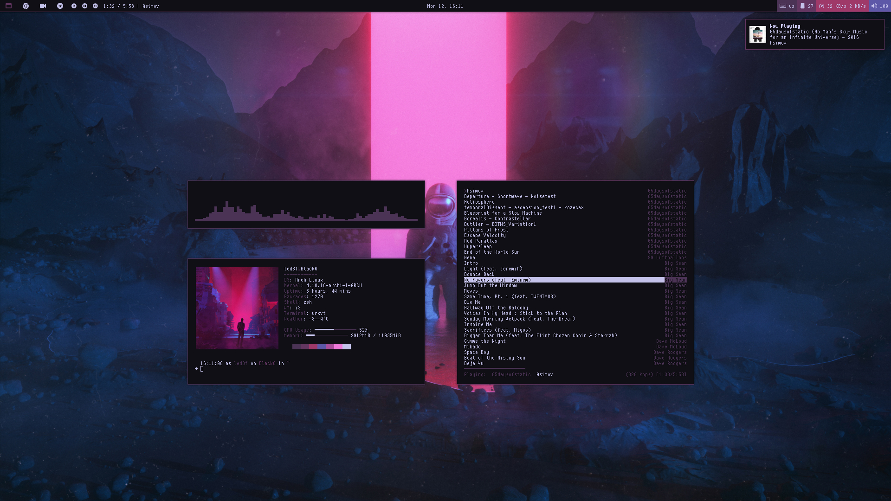

# dots

For Desktop Background image i'm using Nitrogen - https://github.com/l3ib/nitrogen

Sublime theme is ayu dark - https://github.com/dempfi/ayu

Compositor is Compton - https://github.com/chjj/compton

GTK3-Nocsd - https://github.com/PCMan/gtk3-nocsd

Spotify Cli for keyboard shorcuts - https://gist.github.com/streetturtle/fa6258f3ff7b17747ee3

LightDM WebKit2 Theme - https://github.com/Litarvan/lightdm-webkit-theme-litarvan

Files with pywal at the end are for usage with Pywal

# i3

# i3 info

Menu is Rofi - https://github.com/DaveDavenport/rofi

Rofi Power Menu - https://github.com/okraits/rofi-tools

Bar is Polybar - https://github.com/jaagr/polybar

Notification Daemon is Dunst - https://github.com/dunst-project/dunst

Spotify Track Module for Polybar - https://github.com/Jvanrhijn/polybar-spotify

Pipes - https://github.com/pipeseroni/pipes.sh

Mpd Notification - https://github.com/vehk/mpdnotify

Polybar Icon Fonts - Nerd Fonts

Colorschemes - https://github.com/dylanaraps/pywal

Custom templates for rofi and dunst - https://github.com/LeD3F/dots/tree/master/.config/wal/templates 

# 2bwm

# 2bwm info

2bws script - https://github.com/drumsetmonkey/.dotfiles/blob/master/scripts/.scripts/2bws

# Vivaldi

Start Page - https://catgrills.github.io/Galaxy/

Vivaldi Themes:

| Holo Red Theme:                   | Nim Theme:                        |
| --------------------------------- | --------------------------------- |
| Background: #222222               | Background: #121212               |
| Foreground: #ffffff               | Foreground: #ffffff               |
| Highlight: #f0544c                | Highlight: #ad3d37                |
| Accent: #303030                   | Accent: #202020                   |
| [ ] Accent color from Active Page | [x] Accent color from Active Page |
| [ ] Apply Accent Color to Window  | [ ] Apply Accent Color to Window  |
| [x] Transparent Tabs              | [x] Transparent Tabs              |
| Corner Rounding: 2px              | Corner Rounding: 1px              |

# Nemo Plugins

Nemo Media Info Tab - https://github.com/linux-man/nemo-mediainfo-tab

Nemo Audio Tab - https://github.com/linuxmint/nemo-extensions

Nemo File-Roller - https://github.com/linuxmint/nemo-extensions

Nemo Image Converter - https://github.com/linuxmint/nemo-extensions

Nemo Preview - https://github.com/linuxmint/nemo-extensions

Nemo Seahorse - https://github.com/linuxmint/nemo-extensions

# Applications

| Accessories:                 | Development:       | Graphics:              | Games:                  | Internet:        |
| ---------------------------- | ------------------ | ---------------------- | ----------------------- | ---------------- |
| Archive Manager: File-Roller | CMake              | FontForge              | Steam                   | Avahi SSH        |
| Gnome Disks                  | Electron           | GIMP                   | Lutris                  | Avahi VNC        |
| Document Viewer: Xreader     | Qt Designer        | InkSpace               | Linux Steam Integration | Discord          |
| Etcher                       | Qt Assistant       | Image Viewer: GPicView |                         | Deluge           |
| Galculator                   | Qt4 Assistant      | Krita (AppImage)       |                         | Hakuneko Desktop |
| File Manager: Nemo           | Qt Linguist        | MComix                 |                         | Telegram Desktop |
| Password Manager: Seahorse   | Qt4 Linguist       | Simple Scan            |                         | Vivaldi Snapshot |
| Notes: Simplenote            | Qt4 Designer       |                        |                         |                  |
| Winetricks                   | Qt QDBusViewer     |                        |                         |                  |
| compton                      | Qt4 QDBusViewer    |                        |                         |                  |
| Nitrogen                     | Sublime Text 3 Dev |                        |                         |                  |

| Multimedia:           | Office:             | Settings:         | System Tools:                  |
| --------------------- | ------------------- | ----------------- | ------------------------------ |
| EasyTAG               | LibreOffice Base    | ARandR            | Pamac                          |
| Gnac                  | LibreOffice Math    | Lxappearance      | Avahi Zeroconf Browser         |
| GNOME Twitch          | LibreOffice Impress | Java              | Bleachbit                      |
| Kdenlive (AppImage)   | LibreOffice Draw    | NetworkManager    | Baobab                         |
| ncmpcpp               | LibreOffice Calc    | NVIDIA X Settings | Grub Customizer                |
| OBS                   | LibreOffice         | Oomox             | Htop                           |
| Pavucontrol           | LibreOffice Writer  | Qt5ct             | CUPS                           |
| Qt V4L2 video capture | WPS Spreadsheets    | Gotop             | Network Tools                  |
| Qt V4L2 test utility  | WPS Presentation    |                   | Timeshift                      |
| Spotify               | WPS Writer          |                   | LXTask                         |
| SMPlayer              |                     |                   | Vmware Workstation             |
| MPV                   |                     |                   | WoeUSB                         |
| Cava                  |                     |                   | URXvt                          |
